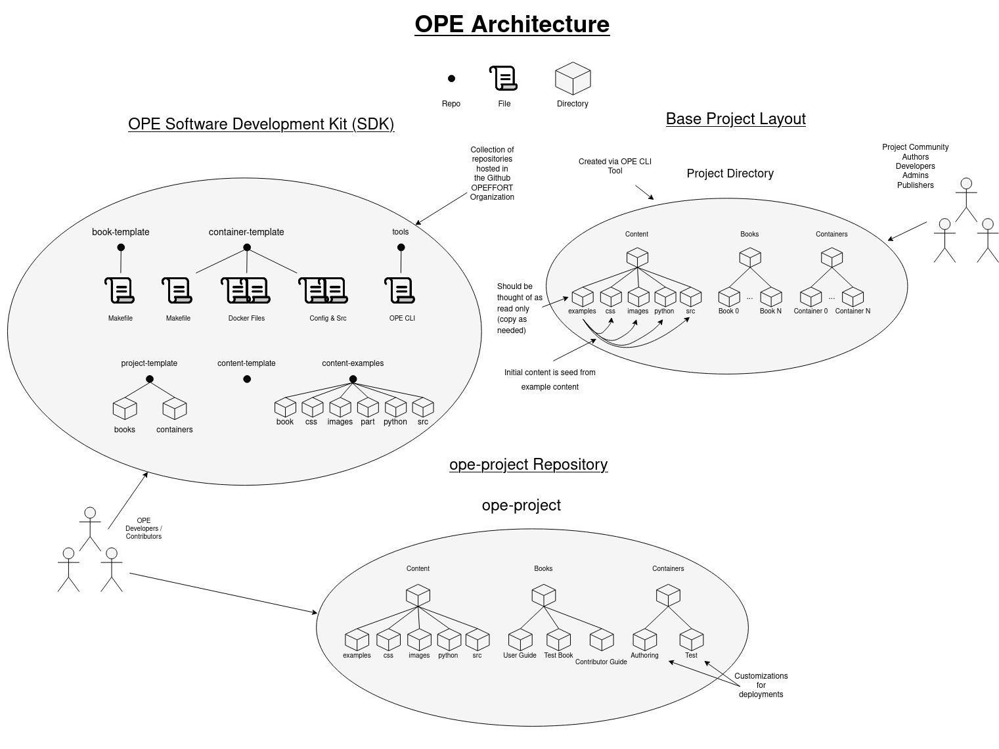

# Open Education User Guide

## Introduction

This user guide is intended to teach you how to author OPE-style books, as well as setup container images that contain all the software required for following along with the book content. 

The OPE project is an initiative towards making education open source, and to achieve highly interactive teaching and presentation material.

## OPE Architecture 


  


## View Published Guides

[User Guide](https://isaiahstapleton.github.io/ope-project/user_guide/user_guide_intro.html)

[Contributor Guide](https://isaiahstapleton.github.io/ope-project/contributor_guide/contributor_guide_intro.html)

## [OPE CLI Tool](https://github.com/OPEFFORT/tools)

Using the official OPE tool, you can easily create, update, manage, and publish OPE projects from the command line. 

### Commands

- **repo_add:** add a repository to a project                                             
- **new_project:** create a new ope project from the ope templates                           
- **new_book:** create a new publishable book for your content                            
- **new_container:** add source for building a new container for your project                  
- **update:** update and rebase changes from the OPE framework                          
- **build:** build the book                                                   
- **pub:** publish the book                                                     
- **new_course:** creates a new ope project seeded with 3 books (textbook, lecture notes, and labmanual) and one container


## Creating a New Project

A project consists of a collection of OPE books and associated container images.

Before you create a project, an empty repository for the project should already be created. 

Assuming that you are using github or gitlab we recommend you create a new organization for your project. If you will be publishing containers as part of your project we also recommend that you create an docker image registery organization.

We also recommend that you create a new email address that will act as the central admin address for your project. Eg. ucsls.organization@gmail.com. You can then use this as the admin and identity for all online resources of your project.

Once this is done, to create a project make sure you have properly installed the OPE CLI tool, then run the following command:

```shell
ope new_project <project name> [repo url]
```

If a repo url was not specified when the project was created, you can add a repo to a project by running the following command within the project directory:

```shell
ope repo_add <repository url>
```

Eg. ope repo_add git@github.com:myuser/opeproject.git"

This will add the repository to the current project in order to store and track all of the project content.

This will create a new directory (with the name of the project) with 3 sub directories:

- books: This directory contains the book(s) for the project
- containers: This directory contains the container images 
- content: This directory contains the content associated with the book(s)


## Creating a New Book

### How to Create a New Book

To create a new book, run the following command within the books directory:

```shell
ope new_book <book name>
```

This will create a new directory with the name of the book, within this directory there is a sub-directory "content" that will contain the content of the book and is seeded with everything needed to get started authoring said book. A symbol link is created for this content directory to the content directory in the home directory (~/content) to store the source files for all books. 


### Editing Book Configuration

- **bookname_config.yml:** This config file is used to change book settings such as: title, author, logo, URL to publish to, and jupyter extensions you would like enabled, etc.

- **bookname_toc.yml:** This file is used to modify the different parts of the book. In the section labeled parts, you can add a new part by specifying it's caption (name of the part), whether it is numbered or not, and then you may specify the different chapters or sections within that part by specifying the files associated with the respective content. 
    - The caption name does not have to be the same name as the directory containing the content for that part (ex. part1 does not have to have the caption: 'part1')
    - The basic layout for a part is as follows:
    ```
     - caption: 'Name of section'
        numbered: true
        chapters:
        - file: directory/file
        sections: 
        - file: dummy_part/section
    ```
    - Each chapter may have its own sub-section

- **bookname_intro.md:** This file is used to create the landing page for the textbook. The content within this file will be the first page displayed when accessing the textbook, lecture notes, or lab manual. 


### Creating Content

There are many different functions you can include in a book such as: displaying a series of slide images, displaying html table, and displaying interactive terminal media player, just to name a few.

The OPE Test Book contains a list of these functions in the 01_special_displays, 02_slides_template, and 03_animations_examples within the content directory. You can access the test book [here](https://github.com/OPEFFORT/OPE-Testing/tree/test-book).

Also take a look at some of the textbooks in the list of OPE Textbooks to see what kind of content they are able to create using OPE.

### Publishing Book

OPE utilizes [GitHub Pages](https://pages.github.com/) to allow you to easily deploy your website for free.

First, make sure in the book_config.yml files that the URL, path to book, and branch are all correct. An example for this textbook is:


```
repository:
  url: https://github.com/IsaiahStapleton/ope-docubook
  path_to_book: content
  branch: main
```

Run the following command in the same directory as the book in order to publish the book:

```shell

make pub

```

After this has been done, there will be a new branch titled 'gh-pages' within your repository. Go to settings -> pages and make sure the branch you are deploying GitHub pages from is the gh-pages branch. At the top of the page it will give you the URL of where the site is live. If you go to that link you may see a 404 error, that is because at the end of the URL you must add the name of the book, for example /user_guide for this project.


## Building Container

### Adding Image Source

To add source for building a new container for your project, run the following command within the container directory:

```shell
ope new_container <container name>
```

This will create a new directory with the name specified for the container. This directory contains the Dockerfile along with necessary associated files for building the container. 

### Adding Software Packages to the Image

In order to add software packages that are not already included in the base OPE image, you are able to edit the ```requirements.txt``` file within the requirements directory. When building the image, these packages will be present in the container environment. 

### Building and Publishing Container

We utilize the make tool to efficiently build, run, tag and publish the container images. You can simply run the command 'make' followed by one of these commands.

- **build** - builds the custom container image
- **push** - append timestamp to current image and push to private registry mentioned in private_registry:private_user files under base. 
- **publish** - tag current image as ope_book_registry/ope_book_user/ope_book files under base directory along with a timestamp and push it like below.
- **pull** - pull the most recent public image 
- **pull-priv** - pulls the most recent private image 
- **root** - executes the private image as root user like below. 
- **user** - executes the private image as the default user 
- **run** - starts published version with jupyter lab interface 
- **run-priv** - starts private version with jupyter lab interface 


## List of OPE Textbooks

The textbooks in the following list are OPE textbooks. Take a look at these for some inspiration.

### UndertheCovers

- [Repository](https://github.com/jappavoo/UndertheCovers)
- [Textbook](https://jappavoo.github.io/UndertheCovers/textbook/intro_tb.html)
- [Lecture Notes](https://jappavoo.github.io/UndertheCovers/lecturenotes/intro_ln.html)
- [Lab Manual](https://jappavoo.github.io/UndertheCovers/labmanual/intro_lm.html) 

### OpenOS

- [Repository](https://github.com/OpenOSOrg/openos)
- [Textbook](https://okrieg.github.io/openos/textbook/intro/pref.html)
